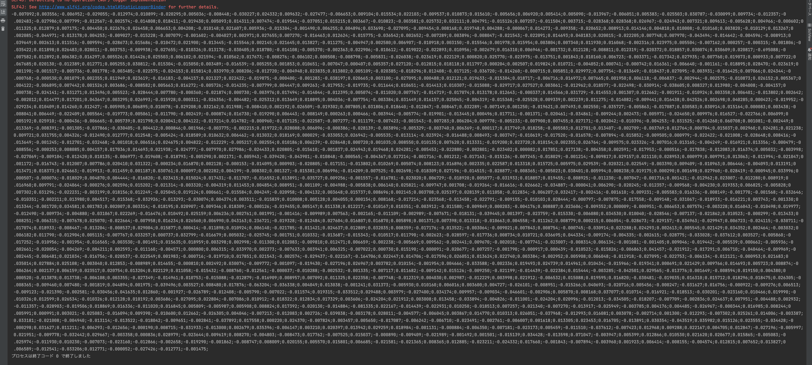

# Javaを利用したOpenAI APIサンプル<!-- omit in toc -->

Javaでの実装方法をいくつか紹介します。

## 環境準備

事前にJavaはインストールされているものとします。

Javaの基礎知識はSOLXYZ Academy「[Java入門](https://academy.solxyz.co.jp/java/java-basic/list)」で学ぶことができます。

また、IDEとして`Eclipse`または`IntelliJ`を使用するものとして解説します。IDEのセットアップはAcademy「[各種ツールインストール手順](https://academy.solxyz.co.jp/common/install-procedure/list)」を参考にしてください。

### リポジトリのクローン

```PowerShell
git clone https://github.com/solxyz-jsn/gpt-sample-with-java.git
```

以降は本リポジトリ内の操作です。プロジェクトフォルダ内に移動します。

```PowerShell
cd gpt-sample-with-java
```

### 利用ライブラリのインストール

`maven install`を行い、ライブラリのダウンロードを行ってください。

Eclipseでは`pom.xml`を右クリックし、「maven」「maven install」の順で実行できます。

IntelliJの場合は画面右端に`maven`タブがあります。これをクリックして「ライフサイクル」から「install」で実行できます。

### Open AIのアクセスキーの設定

```java
    private static final String OPENAI_API_KEY = "あなたのアクセスキー";
```

※本ドキュメントは動作サンプルとしてコード内にキーを入力しますが、アプリケーションとして開発する場合はpropertiesファイルや環境変数から取得するようにしてください。

## 実行方法

### シンプルな例

[SimpleQuery.java](src/main/java/jp/co/solxyz/SimpleQuery.java)

Open AIのAPIを利用して回答を取得します。

Eclipseの場合、ファイルを右クリックして「実行」「Javaアプリケーション」で実行できます。

IntelliJの場合、ファイルを右クリックして「実行」で実行できます。

```shell
prompt: your name?
message: I am an AI language model developed by OpenAI, so I don't have a personal name. You can simply call me OpenAI Assistant. How can I assist you today?
```

入力したプロンプトに対しての回答が生成されます。

### Embeddings

[EmbeddingsSample.java](src/main/java/jp/co/solxyz/EmbeddingsSample.java)

このサンプルでは[Embeddings API](https://platform.openai.com/docs/guides/embeddings)を用いて埋め込みを行います。

※Embeddingsとは自然言語処理の文脈で用いられる用語で、「単語や文章をベクトル化」（つまりN次元の空間に"埋め込み"をする）という意味です。

※本資料での`Embeddings`は自然言語処理の用語ではなく、OpenAI APIの機能としての`Embeddings`を指します。これは単語や文章を渡すとベクトル化した結果を返してくれるAPIです。
（OpenAI APIのEmbeddingsでは、単語や文章を1536次元のベクトルに変換します）

Embeddingsを行うことで、外部データを扱うことが容易になります。

本サンプルでは、次の部分でEmbeddingsを行っています。

```java
    // Embeddings対象のテキストを用意
    EmbeddingsOptions embeddingsOptions = new EmbeddingsOptions(Arrays.asList("Hello World"));

    // モデルを指定してEmbeddingsを行う
    Embeddings embeddings = client.getEmbeddings("text-embedding-ada-002", embeddingsOptions);
```

EmbeddingsはCompletetionモデル（ChatGPT系のモデル）では行えないため、Embeddings専用のモデル（`text-embedding-ada-002`）を使用しています。

プログラムを実行すると、ベクトル化した結果が表示されます。



※PythonやJavaScriptではAPIコールから類似度検索までを自動で行ってくれるフレームワークがありますが、Javaではそのようなものがありません。そのため、ベクトル化部分をAPIコールで行い、ベクトル化したものの保存や類似度検索を自前で実装する必要があります。
